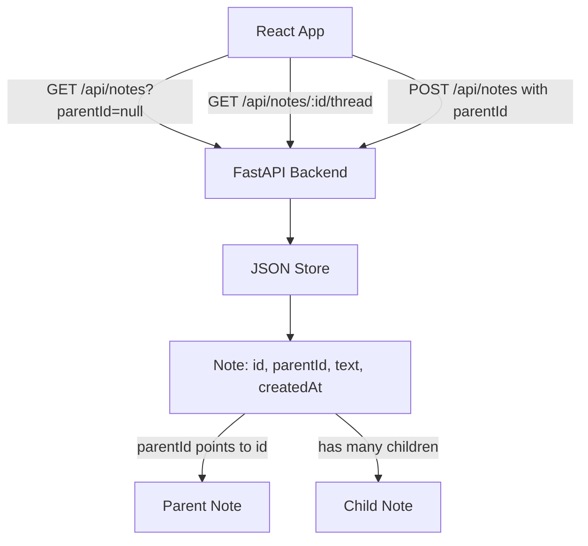

# Threaded App Plan

## Scope

Create a minimal full-stack app in the empty repo using:

- Frontend: Vite + React, likely TypeScript for clearer note/thread data shapes.
- Backend: Python asyncio + FastAPI.
- Persistence: a local JSON data file managed by the backend, keeping setup simple while still separating frontend and API concerns.
- Threading model: every item is a `Note`; root notes have no parent and replies point to another note via `parentId`.

## Files To Add

- [package.json](package.json), [index.html](index.html), [vite.config.ts](vite.config.ts), [tsconfig.json](tsconfig.json): frontend project scaffold.
- [src/main.tsx](src/main.tsx), [src/App.tsx](src/App.tsx), [src/App.css](src/App.css): main note-taking UI and white-grey visual design.
- [backend/main.py](backend/main.py): FastAPI app with async endpoints for root notes, child notes, focused thread views, and ancestor paths.
- [backend/store.py](backend/store.py): small async JSON store for a flat collection of self-referential notes.
- [backend/requirements.txt](backend/requirements.txt): FastAPI and uvicorn dependencies.
- [README.md](README.md): update with setup and run instructions for both services.

## Data Model

Use a single flat `Note` shape. A note is either a root thought or part of a thread depending on whether `parentId` is set; this keeps notes infinitely threadable without separate thread objects.

API shape:

- `GET /api/notes?parentId=` returns root notes when empty/null, or direct children for a selected parent.
- `GET /api/notes/{note_id}/thread` returns the focused note, its direct children, and a paginated ancestor path.
- `POST /api/notes` creates either a root note or a child note based on optional `parentId`.

Ancestor path pagination:

- Return a compact path such as newest N ancestors plus metadata like `hasMoreAncestors`.
- Use clickable parent links in the UI to jump to any visible ancestor's focused thread view.
- Keep this pagination in the API response so the frontend does not need to reconstruct lineage from all notes.

## UI Behavior

- Show the app name `Threaded` in a quiet, white-grey layout.
- Provide a composer for writing a thought and saving it as a note.
- Render the current level as soft grey note cards; at the top level this is root notes, and in focused thread view this is the selected note's children.
- Add a thin grey curved arrow icon at the end of each thought; the icon appears on hover and opens an inline thread input for creating a child note.
- Keep the arrow as inline SVG in React so its stroke, rounding, and hover behavior are easy to tune.
- Include an expand button on inline thread controls. Expanding maximizes that thread, hides upper-level notes, and switches the main view to the selected note's focused thread.
- In focused thread view, show a paginated breadcrumb/path of clickable parent notes above the selected note, so the user can move up the thread hierarchy.

## Verification

- Install frontend and backend dependencies.
- Start FastAPI with uvicorn and Vite dev server.
- Confirm root notes and arbitrarily deep child notes can be created, persist across refreshes, and appear under the correct parent.
- Confirm expanding an inline thread hides the upper-level notes and displays the selected thread with clickable parent path navigation.
- Run available checks such as TypeScript build and any backend import/startup validation.

