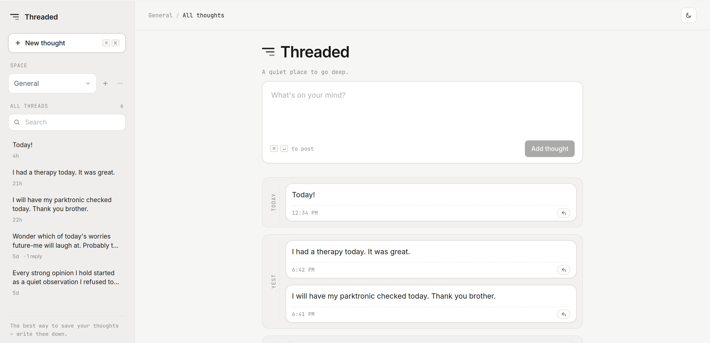

# Threaded

A quiet little notebook for writing down thoughts and following them through
infinitely deep threads.



The repo holds two pieces:

- **Frontend** — a Vite + React (TypeScript) single-page app that renders the
  white-grey UI, the composer, and the focused thread view.
- **Backend** — an async [FastAPI](https://fastapi.tiangolo.com/) service that
  stores self-referential notes in a SQLite database under `backend/data/`.

## Repository layout

```
.
├── backend/
│   ├── main.py            # FastAPI app + endpoints
│   ├── store.py           # Async SQLite note store (aiosqlite)
│   └── requirements.txt   # Python dependencies
├── src/
│   ├── App.tsx            # Threaded UI
│   ├── App.css            # White-grey styling
│   └── main.tsx           # React entry point
├── index.html
├── package.json
├── tsconfig.json
└── vite.config.ts         # Proxies /api to the FastAPI server
```

## Prerequisites

- Docker + Docker Compose

## Running locally with Docker Compose

The repo ships with a `docker-compose.yml` that builds both services and wires
them together, so you can spin up the whole app without installing Node or
Python locally:

```bash
docker compose up --build
```

This will:

- Build and start the FastAPI backend from `backend/Dockerfile`.
- Build and start the frontend (served by nginx) from `src/Dockerfile`,
  exposed on http://localhost:8080.
- Persist the SQLite database in the named volume `threaded-data`
  (mounted at `/data` inside the backend container, with
  `THREADED_DATABASE_PATH=/data/threaded.sqlite3`).

Useful follow-ups:

```bash
docker compose up -d --build      # run detached
docker compose logs -f            # tail logs
docker compose down               # stop containers (keeps the data volume)
docker compose down -v            # stop and wipe the SQLite volume
```

Rebuild after changing dependencies or Dockerfiles with
`docker compose build --no-cache`.

## Frontend live reload in Docker (no image rebuild on edits)

For day-to-day frontend work, use the dev compose override. It runs Vite inside
a Node container with a bind mount, so file changes are picked up immediately.

```bash
docker compose -f docker-compose.yml -f docker-compose.dev.yml up backend frontend-dev
```

Then open http://localhost:5173.

Notes:

- `frontend-dev` uses `npm run dev` instead of the nginx production image.
- Source code is bind-mounted (`./:/app`) so edits hot-reload without rebuilding.
- API requests still go through `/api`; in this mode Vite proxies to
  `http://backend:8000` via `VITE_API_TARGET`.

Stop the stack with:

```bash
docker compose -f docker-compose.yml -f docker-compose.dev.yml down
```

On first request the backend initializes the SQLite schema and enables WAL
mode. The database lives at `/data/threaded.sqlite3` inside the container
(persisted in the `threaded-data` volume); override the location with
`THREADED_DATABASE_PATH=/path/to/threaded.sqlite3`.

## Backend reference

### Schema

```sql
CREATE TABLE notes (
  id TEXT PRIMARY KEY,
  parent_id TEXT REFERENCES notes(id) ON DELETE CASCADE,
  text TEXT NOT NULL,
  created_at TEXT NOT NULL
);

CREATE INDEX idx_notes_parent_id_created_at
  ON notes(parent_id, created_at);
```

Child lookups (`list_children`) and primary-key fetches (`get`) hit the
indexes; ancestor walks use a recursive CTE with a depth guard to stay safe
if data ever gets corrupted into a cycle.

### API summary

- `GET /api/notes?parentId=` — list root notes when empty/null, or direct
  children for a parent.
- `GET /api/notes/{id}/thread` — focused note, its children, and a paginated
  ancestor path (newest ancestors plus `hasMoreAncestors` / `totalAncestors`).
- `POST /api/notes` — create a root note (no `parentId`) or a child note.

## How threading works

- Every item is a `Note { id, parentId, text, createdAt }`.
- Root notes have `parentId === null`.
- Hovering a card reveals a small curved thread arrow; clicking it opens an
  inline composer for a child note. The inline composer also includes an
  **Expand** button that switches the view to the focused thread for that
  parent.
- Focused thread view shows a clickable, paginated breadcrumb so you can step
  back up the lineage one note at a time.

## To Do
- [ ] Refine shortcuts (ctrl+n for new note, arrows up and down to navigate thoughts, enter to go one level deeper, backspace to go one level upper)
- [ ] Add tags
- [ ] Add date range filter
- [ ] Add ability to edit thoughts
- [ ] Add ability to delete thoughts (send them into 30-day retention trash)
- [x] Add collapse arrow for opening threads
- [ ] Make composer sticky at the top
- [ ] Add sort/filter on main canvas (somewhere near composer). It should stay on each thread. Add
list of popular tags with counts
- [x] Add grouping by date for better visibility and structure
- [ ] Add auth with Google/Apple
- [ ] Deploy
- [ ] Add colors?
- [x] Implement tree-like navigation for thoughts (or in sidebar display adjacent cards, instead of roots)
- [ ] Add thought spaces
- [ ] Add reactions and filter by reaction
- [ ] Add buy me a coffee link
- [ ] Додати маркери, виділення тексту, text editor 
